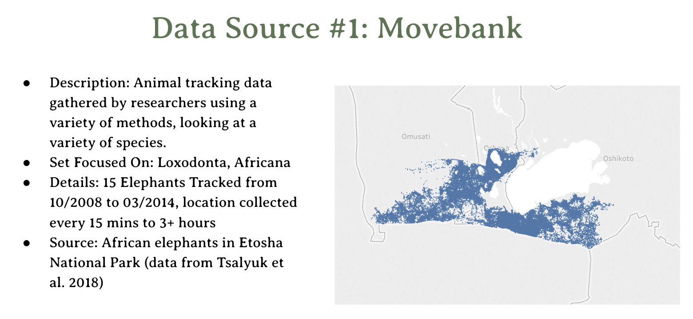

# Ranger-Radar

2019 Zoo Hackathon Project built to provide African Rangers a way to track live animal movements and 
human encroachment. We were given a list 10 problems/challenges to decide on 1 as a team. Which was 
giving the Rangers a tool to provide up to date information on animal movement corridors and where/how 
human encroachment was effecting it, this problem statement came to be quite a challenge for us in that 
it was apparent information like this would not be provided easily as poachers could use it for their 
advantage. However, we did the best with what we had and used multiple API's to show what the objective 
of our application was and provided ideas for future technology implementations such as Raspberry Pi's 
and using animal "thumbprinting"/facial+shape recognition technology. My responsibility in this project 
was mainly to create the interface for the application and also assisted in our search for API's and 
resources for us to use, planning with the team, and was a main representer for our presentation for how 
our App works.

#### Please feel free to review the code in this repository as there is not much front end to visualize 
other than what has been featured above, backend code was commited to another version of this repo just 
before getting our practice in to present.

* **Thank you**, ***-Miles Mickelson***
